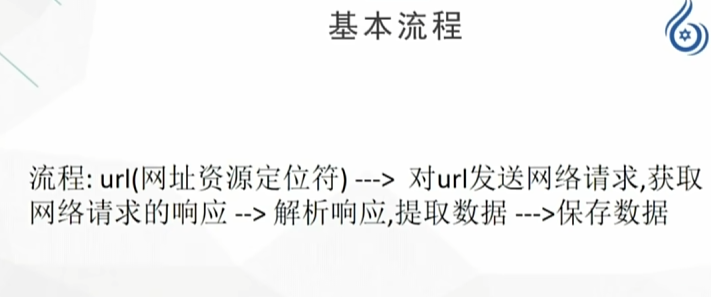
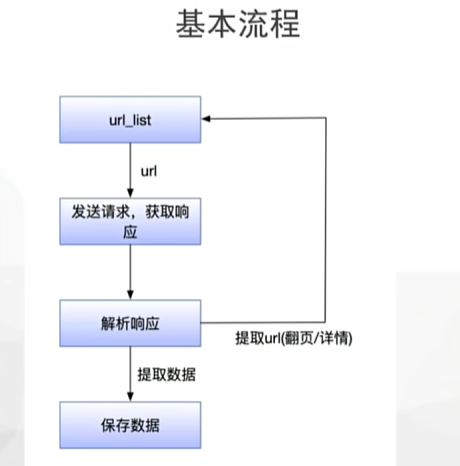
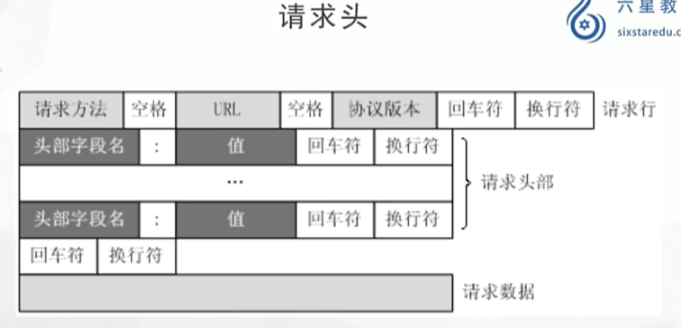
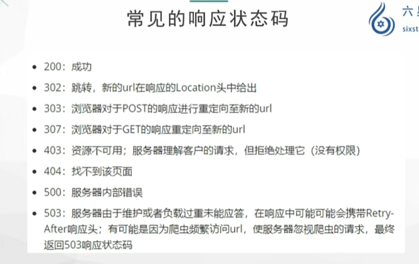
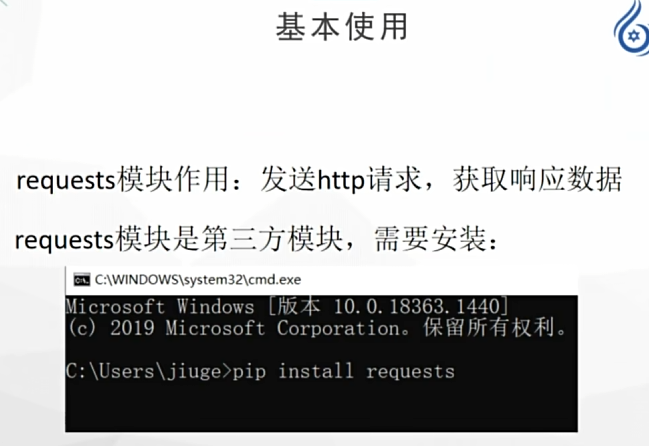
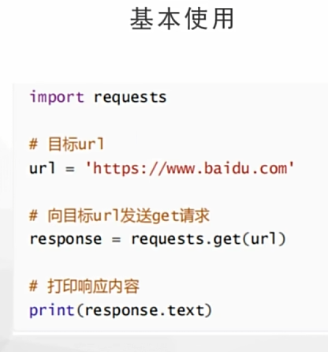
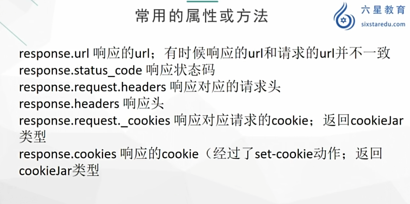
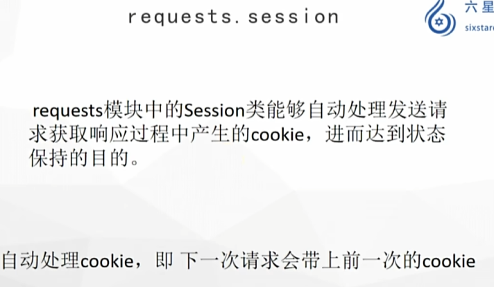
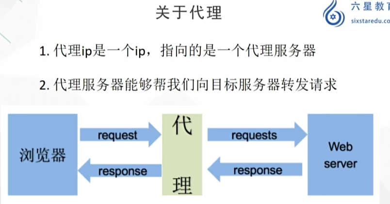
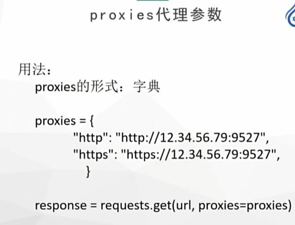

# **<mark>python爬虫相关介绍</mark>**

## **<mark>爬虫概念</mark>**

### **<mark>网络请求</mark>**

https://www.baidu.com     --url 统一资源定位符

#### **请求过程：**

客户端，指web浏览器向服务器发送请求

请求分为四部分：

1. 请求网址   --request    url

2. 请求方法   --request   methods

3. 请求头    --request   header

4. 请求体   --request  body 

F12查看请求相应

#### **爬虫的作用：**

1. 数据采集

2. 软件测试

3. 抢票

4. 网络安全

5. web漏洞扫描

## <mark>爬虫的分类</mark>

根据爬取网站的数量，可以分为：

通用爬虫

聚焦爬虫（主要学习）

根据获取数据的目的：功能性爬虫、数据增量爬虫


## **<mark>爬虫基本流程</mark>**





1. 确认目标：目标url：www.baidu.com

2. 发送请求：发送网络请求，获取到特定的服务端给你的响应

3. 提取数据：从响应中提取特定的数据       jsonpath/xpath/re

4. 保存数据：本地（html、json、txt）、数据库

获取到的响应中，有可能会提取到还需要继续发送请求的url，可以拿着解析到的url继续发送请求

### **robots协议**

robots协议并不是一个规范，只是约定俗成

### **网络通信步骤**

电脑（浏览器）：  url    ----www.baidu.com

DNS服务器：IP地址标注服务器  -----1.1.1.1  IP地址

DNS服务器返回IP地址给浏览器

浏览器拿到IP地址去访问服务器，返回响应

服务器返回给我们的响应数据：html、css/js/jpg....

### **百度首页：实际上由很多部分组成起来**

html：文本

css：样式，控制文字大小、颜色

js：行为，包括鼠标点击

jpg：图片

| 技术         | 作用   | 类比    |
| ---------- | ---- | ----- |
| HTML       | 网页结构 | 人的骨架  |
| CSS        | 网页样式 | 衣服、外貌 |
| JavaScript | 网页交互 | 动作、行为 |

### **网络通信的实际原理：**

一个请求只能对应一个数据包（文件）

之后抓包可能会有很多个数据包，共同组成了这个页面

## **<mark>请求头</mark>**

### **http协议和https协议**

http协议：规定了服务器和客户端互相通信的规则

http协议：超文本传输协议，默认端口号是80

超文本：不仅仅限于文本，还包括图片、音频、视频

传输协议：指使用共用约定的固定格式来传递转换成字符串的超文本内容

https协议：http+ssl（安全套接字层），默认端口号443

带有安全套接字层的超文本传输协议

ssl对传输的内容进行加密

**https比http更安全，但是性能更低**

http请求/响应的步骤：

1. 客户端连接到web服务器

2. 发送http请求

3. 服务器接受请求返回响应

4. 释放连接tcp连接

5. 客户端解析html内容



请求方式：get和post

get向服务器要资源

post向服务器提交资源



User-Agent：模拟正常用户

cookie：登录保持

referer：当前这一次请求是由哪个请求过来的

抓包得到的响应内容才是判断依据，elements中的源码是渲染之后的源码，这个不能作为判断标准

## **<mark>requests基本使用</mark>**





```
import requests

url='https://www.baidu.com/'
#发送请求
response = requests.get(url)
print(response)
#<Response [200]> 200是状态码
#打印响应
print(response.text)
#响应内容有乱码，requests模块会自动寻求一种解码方式去解码
print(response.content.decode('utf-8'))  
```

### **使用requests保存图片**

```
import requests

#使用requests库保存图片
#确定url
url='https://pica.zhimg.com/v2-a89d7a5e0a4464ebd627a514f3f76b3a_720w.jpg?source=172ae18b'
#发送请求，获取响应
res= requests.get(url)
print(res.content)
#保存响应
with open("1.jpg", "wb") as f:
    f.write(res.content)
```

### **response.text和response.content的区别**

text：str类型，request模块自动根据http头部对响应的编码做出有根据的推测

content：bytes类型，可以通过decode（）解码



request是发出的，response是收到的

## **<mark>用户代理</mark>**

### **user-agent**

百度首页代码爬取到的比较少

请求头中uer-agent字段必不可少，表示客户端的操作系统以及浏览器的信息

```
#构建请求头
headers={
    'Mozilla/5.0 (Windows NT 10.0; Win64; x64) AppleWebKit/537.36 (KHTML, like Gecko) Chrome/151.0.0.0 Safari/537.36 Edg/151.0.0.0'
}
```

```
#带上user-agent发送请求
#发送请求
#headers参数接收字典形式的请求头，请求头字段名为key，值为value
response=requests.get(url,headers=headers)
print(len(response.content.decode()))
```

添加user-agent的目的是为了让服务器认为是浏览器在发送请求，而不是爬虫程序在发送请求

User-Agent池就是保存多个浏览器身份信息，在爬虫请求时随机切换，让服务器难以简单判断请求来自同一个程序。

```
#第一种：构建user-agent池
import requests
import random

user_agents = [
    "Mozilla/5.0 Chrome/151.0",
    "Mozilla/5.0 Firefox/142.0",
    "Mozilla/5.0 Safari/537.36"
]

url="https://example.com"

headers={
    "User-Agent": random.choice(user_agents)
}

response=requests.get(url,headers=headers)


#第二种  fake_usragent 可能会出现异常
from fake_useragent import UserAgent
print(UserAgent().random)
```

| 域名   | 用途   |
| ---- | ---- |
| .com | 商业网站 |
| .org | 组织   |
| .edu | 教育机构 |
| .gov | 政府   |
| .cn  | 中国   |

```
                    URL
                     |
     --------------------------------
     |              |               |
   协议           域名            路径
     |              |               |
 https://     www.baidu.com     /index.html
```

### **浏览器发送请求原理**

1. 构建请求

2. 查找缓存

3. 准备ip地址和端口

4. 等待tcp队列

5. 建立tcp连接

6. 发送http请求

浏览器会向服务器发送请求行，包括了请求方法，请求url，http协议

## **<mark>发送带参数的请求</mark>**

### **url传参**

```
https://www.bing.com/search?q=%E5%AD%A6%E4%B9%A0%E9%80%9A&form=ANNTH1&refig=6a72fd29b09b48b7ac9618db2a3af3d2&pc=ASTS
#字符串被当作url，提交时会被自动进行url编码处理
#输入------学习               明文
#发送请求的时候-----%E5%AD%A6%E4%B9%A0%E9%80%9A            密文
from urllib.parse  import quote,unquote
#quote()   #明文转密文
#unquote()  #密文转明文

print(quote('参数'))  #%E5%8F%82%E6%95%B0
print(unquote('%E5%8F%82%E6%95%B0'))  #参数
```

### **使用公开测试接口查看参数传递**

```
import requests

url = "https://httpbin.org/get"

headers = {
    "User-Agent":
        "Mozilla/5.0 (Windows NT 10.0; Win64; x64) "
        "AppleWebKit/537.36 (KHTML, like Gecko) "
        "Chrome/151.0 Safari/537.36"
}

keyword = input("请输入关键字：")


params = {
    "q": keyword
}

res = requests.get(
    url,
    headers=headers,
    params=params
)

print("实际请求URL：")
print(res.url)

print("\n服务器返回内容：")
print(res.text)
```

## **<mark>Cookie 和 Token 的主要区别</mark>**

|      | Cookie      | Token     |
| ---- | ----------- | --------- |
| 本质   | 存储数据的机制     | 身份凭证      |
| 保存位置 | 浏览器Cookie区域 | 客户端任意位置   |
| 自动发送 | 浏览器自动发送     | 通常需要手动添加  |
| 常用于  | 传统网站登录      | API、移动端登录 |
| 格式   | 键值对         | 字符串       |

```
                 身份认证

                    |
        -------------------------
        |                       |
     Cookie                   Token
        |                       |
  保存身份状态                 证明身份
        |
     Session
        |
服务器保存用户信息
```

|            | 作用         | 什么时候用    |
| ---------- | ---------- | -------- |
| User-Agent | 说明客户端类型    | 几乎每次请求   |
| Cookie     | 保存状态、身份    | 登录后的连续访问 |
| Token      | 证明权限、身份    | API、登录认证 |
| Session    | 服务器保存的用户状态 | 配合Cookie |

进入某些网站时，需要通过登录获得 Token 或 Cookie；之后在同一个网站继续操作时，浏览器会携带 Cookie 或 Token，让服务器知道你已经认证过。

## **<mark>贴吧单页获取（可能会遭遇反爬：百度安全验证，该例仅作为</mark>**

## **<mark>示例）</mark>**

现在爬需要Cookie

```
import  requests

url='https://tieba.baidu.com/f?kw=%E9%87%8D%E5%BA%86%E9%82%AE%E7%94%B5%E5%A4%A7%E5%AD%A6&fr=personalize_page'
headers = {
    'User-Agent':'Mozilla/5.0 (Windows NT 10.0; Win64; x64) AppleWebKit/537.36 (KHTML, like Gecko) Chrome/151.0.0.0 Safari/537.36 Edg/151.0.0.0'
}
res = requests.get(url,headers=headers)
print(res.text)
```

### **改写为面向对象**

```
import  requests


class Tieba:
    def __init__(self):
        self.url='https://tieba.baidu.com/f?kw=%E9%87%8D%E5%BA%86%E9%82%AE%E7%94%B5%E5%A4%A7%E5%AD%A6&fr=personalize_page'
        self.headers = {
    'User-Agent':'Mozilla/5.0 (Windows NT 10.0; Win64; x64) AppleWebKit/537.36 (KHTML, like Gecko) Chrome/151.0.0.0 Safari/537.36 Edg/151.0.0.0'
}
    #发送请求
    def send(self,params):
        res=requests.get(self.url,headers=self.headers,params=params)
        return res.text
    #保存数据
    def save(self,page,con):
        with open(f'{page}.html','w',encoding='utf-8') as f:
            f.write(con)
    def run(self):
        word=input("请输入贴吧名字：")
        pages=int(input('请输入页数：'))

        for page in range(pages):
            params={
                'kw':word,
                'page':page*50
            }
        #循环执行
        data=self.send(params)
        self.save(page,data)
te=Tieba()
te.run()
```

## **<mark>post请求</mark>**

post请求：登录注册，传输大文本内容

```
import requests
requests.post(url,data)
#data参数接收一个字典
```

### **get跟post区别**

get请求---比较多

post请求---比较少

get请求直接向服务器发送请求，获取响应内容

post请求是先给服务器一些数据，然后再获取响应

get请求携带参数------params

post请求携带参数-----data

## **<mark>cookie（模拟登录）</mark>**

```
import  requests

url='https://tieba.baidu.com/f?kw=%E9%87%8D%E5%BA%86%E9%82%AE%E7%94%B5%E5%A4%A7%E5%AD%A6&fr=personalize_page'
headers = {
    'User-Agent':'Mozilla/5.0 (Windows NT 10.0; Win64; x64) AppleWebKit/537.36 (KHTML, like Gecko) Chrome/151.0.0.0 Safari/537.36 Edg/151.0.0.0',
    'Cookie':'__bid_n=1971c8de02c9648fe75856; BAIDU_WISE_UID=wapp_1762356262568_729; BAIDUID_BFESS=E6B3685E7C9A8191EBC7F8CFFCE69B02:FG=1; BIDUPSID=E6B3685E7C9A8191EBC7F8CFFCE69B02; PSTM=1785683551; ZFY=hVRfzmtDfW8IzLbvlOQrqXw7KByMkMpTnRcrACmCFzs:C; BA_HECTOR=ah202l8lal2k0ga1ah05alak00ah051l76lkj29; BDUSS=mk4aEdPRzlhOXhkSHh0ZUhtWWFITXhvWndwQ2U4bE5mNkNpZ052MWhabkk0NXBxSVFBQUFBJCQAAAAAAQAAAAEAAACwLFQfAAAAAAAAAAAAAAAAAAAAAAAAAAAAAAAAAAAAAAAAAAAAAAAAAAAAAAAAAAAAAAAAAAAAAAAAAAAAAAAAAAAAAMhWc2rIVnNqd; BDUSS_BFESS=mk4aEdPRzlhOXhkSHh0ZUhtWWFITXhvWndwQ2U4bE5mNkNpZ052MWhabkk0NXBxSVFBQUFBJCQAAAAAAQAAAAEAAACwLFQfAAAAAAAAAAAAAAAAAAAAAAAAAAAAAAAAAAAAAAAAAAAAAAAAAAAAAAAAAAAAAAAAAAAAAAAAAAAAAAAAAAAAAMhWc2rIVnNqd; STOKEN=4d4ffd348fe4f9378cfd27b1927c06623af393a1eff29e9b7bf9a2813a50fa1f; USER_JUMP=-1; Hm_lvt_292b2e1608b0823c1cb6beef7243ef34=1785943681,1785983896; HMACCOUNT=A4D9381400C7FE13; BDRCVFR[abe9uUBlp-C]=mbxnW11j9Dfmh7GuZR8mvqV; H_PS_PSSID=63140_67862_71687_71945_71929_71943_71936_71925_71953_71946_71933_72065_72073_72069_72098_72179_72259_72279_72372_72402_72356_72423_72464_72484_72498_72495_72503_72513_72520_72544_72591_72560_72571_72606_72615_72594_72622_72643_72660_72653_72657_72663_72664_72686_72693_72432_72757_72742_72713_72724_72777_72706_72794_72800_72856_72837_72822_72889; H_WISE_SIDS=63140_67862_71687_71945_71929_71943_71936_71925_71953_71946_71933_72065_72073_72069_72179_72259_72279_72372_72402_72356_72423_72464_72484_72498_72495_72503_72544_72591_72560_72571_72606_72615_72594_72622_72643_72660_72653_72657_72663_72664_72686_72693_72432_72757_72742_72713_72724_72777_72706_72794_72800_72856_72837_72822_72889; Hm_lpvt_292b2e1608b0823c1cb6beef7243ef34=1785983926; TIEBA_NEW_PC=1; TIEBA_SID=H4sIAAAAAAAAAzMytrAwN403AgBZtZH4CAAAAA; ab_sr=1.0.1_NzQwOTA1N2QyZjljMDQ0YzQ4MDg3YTNiMWVkYmRmNDQwZWQ0ZTQ4N2U5NDgwNTIyNDBlOGQ1NzQ0YmY1ZjBjYjIyMDlkOThhMDRhOThhMWZlODRjMTkyMjcyZTBlODNhYmNhZGM3MWQxZWU4ZjdlNjlhZTU2MDZmM2U2YzFhMTBiMWRiNjgyMmMxMGEyMGIwN2U0OGU0NjE1MDQzOGVjYjhmN2QwZGE1NWMzOTExZDlmMjU1M2MzOTk0NDY4Nzlm; TIEBAUID=cd490761a29e1399b4ca5bbd'
}
res = requests.get(url,headers=headers)
print(res.status_code)
print(len(res.text))
print(res.text)
```

## **<mark>post请求举例-----金山翻译</mark>**

### **json.loads()**

全称：

```
json load string
```

意思：

> 加载 JSON 字符串

作用：它把JSON字符串转换成Python字典，因为大多数接口返回的都是 **JSON字符串**，所以需要用到json.loads()

res.text类型：str

### json.loads() 和 json.load()区别

容易混：

#### loads（s代表string）

处理字符串：

```
json.loads('{"a":1}')
```

#### load

处理文件：

例如：

```
with open("data.json") as f:    data=json.load(f)
```

读取文件里的 JSON。

### **金山翻译代码示例**

```
import json

import requests

a=input("请输入想要翻译的中文:")
url = "https://dictionary.iciba.com/dictionary/fy/batch"

params = {
    "client": "6",
    "key": "1000006",
    "timestamp": "1786014874355",
    "signature": "340df6f7d3ed83508269aeba40eaf7e3"
}   #根据网页上的看，网络--负载那一栏

headers = {
    "User-Agent":
        "Mozilla/5.0",    #表示：我是一个现代浏览器，可以支持新的网页标准。

    "Content-Type":
        "application/json"  #就是告诉服务器：「请按照 JSON 格式解析我的请求内容。」，
    #也可以不写，因为requests会自动把Python字典转换成JSON格式
}

data = {
    "from": "auto",
    "to": "auto",
    "textList": [
        a
    ]
}   #根据网页上的看，网络--负载那一栏

res = requests.post(
    url,
    params=params,
    headers=headers,
    json=data    #就是告诉服务器：「请按照 JSON 格式解析我的请求内容。」
)

# print(res.status_code)
# print(res.text)
dic=json.loads(res.text)     #把服务器返回的 JSON 字符串，转换成 Python 字典。
print(dic['data'][0]['out'])
```

## **<mark>session</mark>**



```
session=requests.session()  #实例化session对象
response=session.post(url,data=data)
#使用session访问登录以后的页面
session.get(url.text)
```

1. 对访问登录后才能访问的页面去进行抓包

2. 确定登录请求的url地址，请求方法和所需的参数

3. 确定登录后才能访问的页面url和请求方法

4. 利用requests.session完成代码

## **<mark>cookie池</mark>**

user-agent池：短时间内多次发出请求，尽量每一次的请求都用不同的用户代理

cookie池：每一个cookie就代表一个账号

cookie有有效期

session不用担心有效期的问题

### **cookie跟session的区别：**

1. cookie数据放在客户的浏览器上，session数据放在服务器上

2. cookie不是很安全，别人可以分析存放在本地的cooker并进行cookie欺骗，考虑到安全应当使用session

3. session会在一定时间内保存在服务器上，考虑到减轻服务器性能方面，应当使用cookie

4. 可以考虑将登录信息等重要信息存放在session，其他信息如果需保留，可以放在cookie中

|                  | 存放位置      | 作用         |
| ---------------- | --------- | ---------- |
| Cookie           | 用户浏览器     | 保存身份标识     |
| Session          | 服务器       | 保存用户真实状态   |
| requests.Session | Python客户端 | 帮助保存Cookie |

## **<mark>代理ip</mark>**

代理ip是一个ip，指向的是一个代理服务器

代理服务器能够帮我们向目标服务器转发请求

ip地址：精确的定位



### **代理：正向代理、反向代理**

正向代理：给客户端做代理，让服务器不知道客户端的真实身份，保护自己的ip地址不会被封，要封也是封代理ip

反向代理：给服务器做代理，让浏览器不知道服务器的真实地址

正向代理保护客户端，反向代理保护服务端

实际上理论来说分为三类：

1. 透明代理：服务器知道我们使用了代理ip，也知道真实ip

2. 匿名代理：服务器能够检测到使用了代理ip，但是不知道真实ip

3. 高匿代理：服务器既不能检测到使用代理ip，也不知道真实ip



proxies={

        以键值对的形式，固定的语法，IP地址：端口号

}

```
#构建代理字典
proxies={
    #第一种写法
    'http':'12.34.56.79:9527'
    #第二种写法
    'http':'http://12.34.56.79:9527'
}
res=requests.get(url,headers=headers,proxies=proxies)
print(res.content.decode())
```

<u>注意：</u>代理ip无效，会自动使用本机的真实ip
