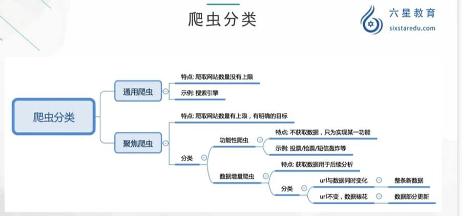

# **<mark>python爬虫相关介绍</mark>**

## **<mark>爬虫概念</mark>**

### **<mark>网络请求</mark>**

https://www.baidu.com     --url 统一资源定位符

#### **请求过程：**

客户端，指web浏览器向服务器发送请求

请求分为四部分：

1. 请求网址   --request    url

2. 请求方法   --request   methods

3. 请求头    --request   header

4. 请求体   --request  body 

F12查看请求相应

#### **爬虫的作用：**

1. 数据采集

2. 软件测试

3. 抢票

4. 网络安全

5. web漏洞扫描

#### 爬虫的分类：

根据爬取网站的数量，可以分为：

通用爬虫

聚焦爬虫（主要学习）

根据获取数据的目的：功能性爬虫、数据增量爬虫

