# **<mark>层次分析法</mark>**

先写判断矩阵

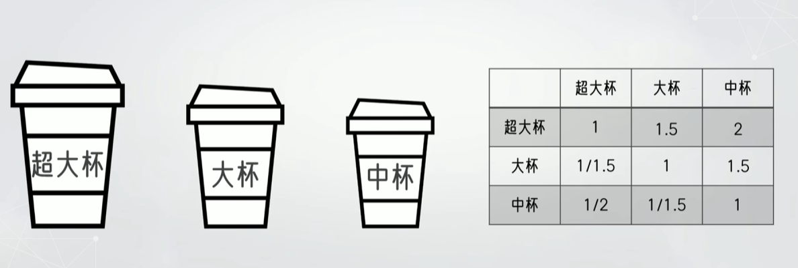

判断矩阵的值是由行/列值得来的

然后再进行一致性检验（目的是减少误差）

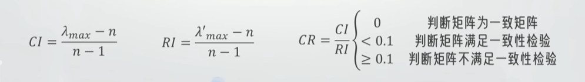


## **求解步骤**

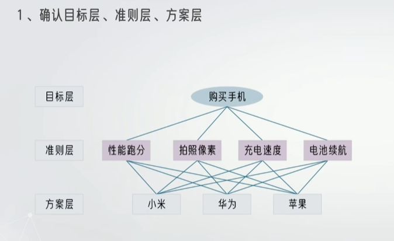

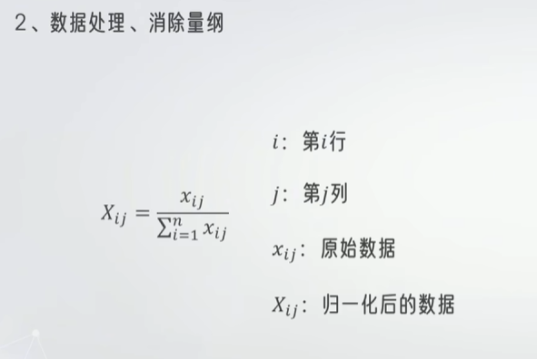

归一化：用每个数据去除以它所在列的和（其实就是计算比重）

归一化后得到的依然是一个和原矩阵相同大小的矩阵

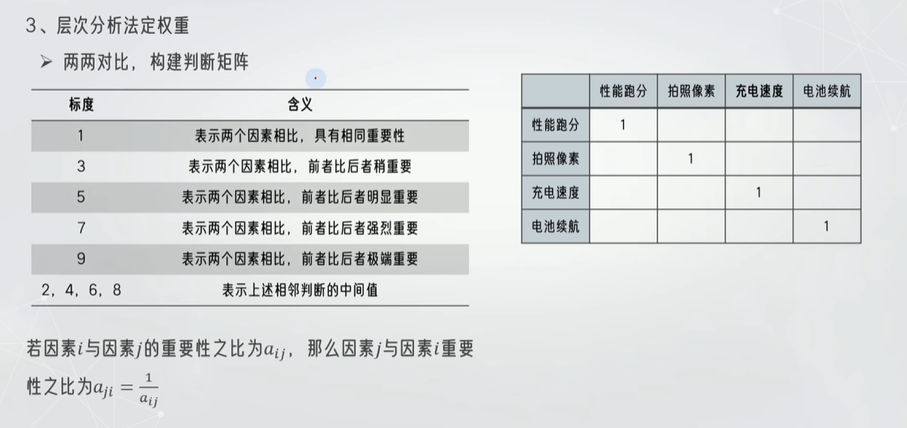

如果题目中没有给出数据，那么判断矩阵的数据可以通过查资料获取（客观），也可以通过上图中的两两比较来构建判断矩阵（主观）

### **一致性矩阵的特征**

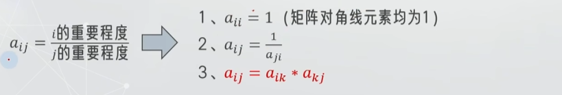

前两条就是构造判断矩阵的基础要求

满足第三条的判断矩阵就是一致性矩阵

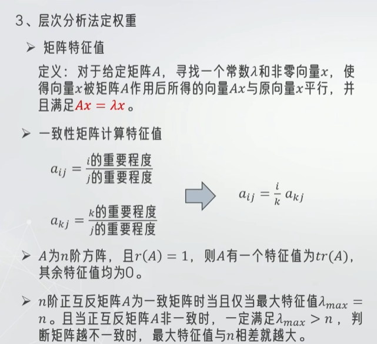

迹：tr(A)：A的对角线元素之和

对于一致性矩阵来说，矩阵的对角线元素均为1，所以一致性矩阵的迹为n（n为矩阵的阶数）

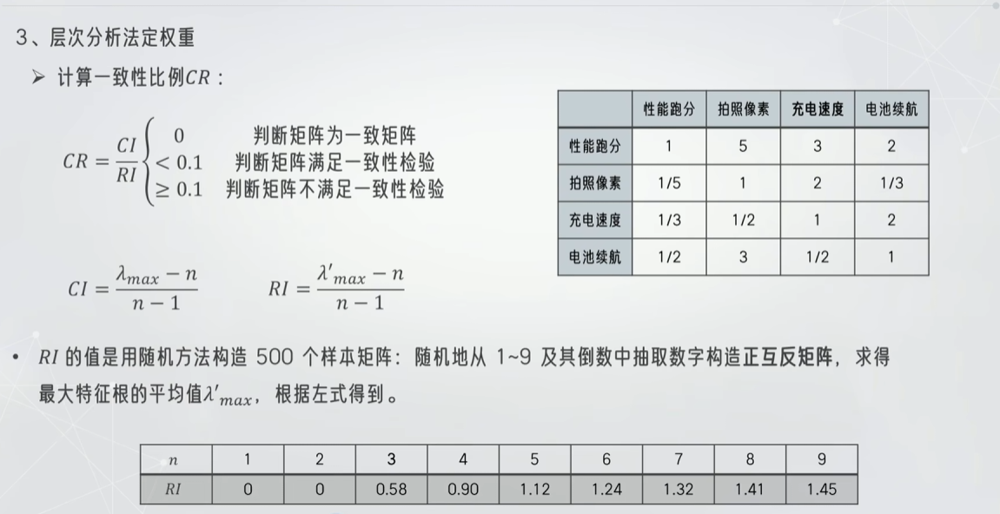

只有通过一致性检验，所求得的权重才是有效的

λmax​就是根据判断矩阵计算得到的最大特征值（最大特征根）

特征值通过|A-λE|=0进行求取

在层次分析法（AHP）的一致性检验中，**RI（Random Index，随机一致性指标）一般不用自己计算，而是根据判断矩阵的阶数 n，直接查固定表格得到。**

| 矩阵阶数 n | RI   |
| ------ | ---- |
| 1      | 0    |
| 2      | 0    |
| 3      | 0.58 |
| 4      | 0.90 |
| 5      | 1.12 |
| 6      | 1.24 |
| 7      | 1.32 |
| 8      | 1.41 |
| 9      | 1.45 |
| 10     | 1.49 |
| 11     | 1.51 |
| 12     | 1.48 |
| 13     | 1.56 |
| 14     | 1.57 |
| 15     | 1.59 |

```
import numpy as np

#定义判断矩阵A
A=np.array([[1,5,3,2],[1/5,1,1/2,1/3],[1/3,2,1,1/2],[1/2,3,2,1]])
n=A.shape[0]  #获取A的行
#求出最大特征值以及对应的特征向量
eig_val,eig_vec=np.linalg.eig(A)   #eig_val是特征值，eig_vec是特征向量
Max_eig=max(eig_val) #求出特征值的最大值
CI=(Max_eig-n)/(n-1)
RI=[0,0.00001,0.58,0.90,1.12,1.24,1.32,1.41,1.45,1.49,1.51,1.48,1.56,1.57,1.59]
#这里n=2时，一定是一致矩阵，所以CI=0，我们避免分母为0，将这里的第二个元素改为了很接近0的正数
CR=CI/RI[n-1]
print('一致性指标CI=',CI)
print('一致性比例CRI=',CR)
if CR<0.10:
    print('因为CR<0.10，所以该判断矩阵A的一致性可以接受！')
else:
    print('注意：CR>=0.10，因此该判断矩阵A需要进行修改！')
```

### **计算权重（一共三种方法）**

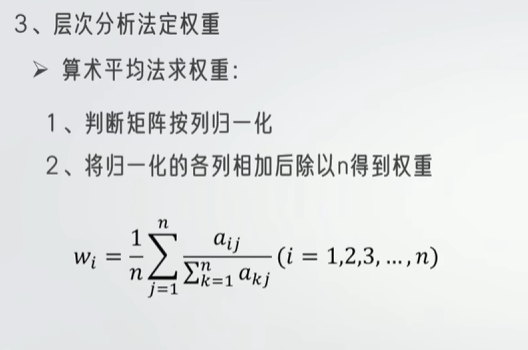

归一化后得到的依然是一个和原矩阵相同大小的矩阵

```
import numpy as np

#定义判断矩阵A
A=np.array([[1,5,3,2],[1/5,1,1/2,1/3],[1/3,2,1,1/2],[1/2,3,2,1]])
#计算每列的和
ASum=np.sum(A,axis=0)  #axis=0表示沿着行方向计算，对每一列求和,ASum为列表形式
#获取A的行数
n=A.shape[0]
#归一化
Stand_A=A/ASum
#将各列相加到同一行
ASumr=np.sum(Stand_A,axis=1)
#计算权重向量
weights=ASumr/n
print(weights)
```

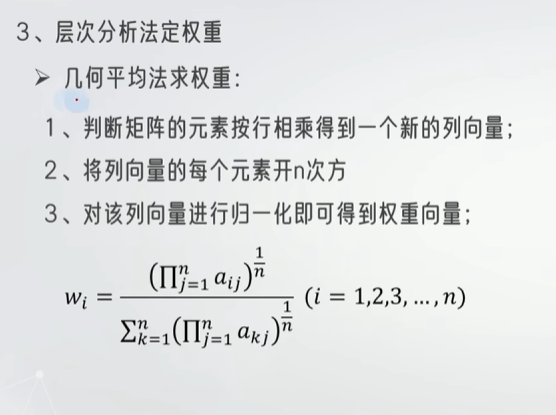

```
import numpy as np

#定义判断矩阵A
A=np.array([[1,5,3,2],[1/5,1,1/2,1/3],[1/3,2,1,1/2],[1/2,3,2,1]])
#获取A的行和列
n,_=A.shape
#将A中每一行元素相乘得到一列向量
prod_A=np.prod(A,axis=1)
#将新的向量每个向量开n次方等价求1/n次方
prod_n_A=np.power(prod_A,1/n)
#归一化处理
re_prod_A=prod_n_A/np.sum(prod_n_A)
#显示权重结果
print(re_prod_A)
```

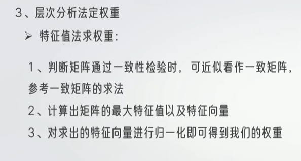

```
import numpy as np

#定义判断矩阵A
A=np.array([[1,5,3,2],[1/5,1,1/2,1/3],[1/3,2,1,1/2],[1/2,3,2,1]])
#获取A的行和列
n,_=A.shape
#求出特征值和特征向量
eig_values,eig_vectors=np.linalg.eig(A)
#找出最大特征值的索引
max_index=np.argmax(eig_values)
#找出对应的特征向量
max_vector=eig_vectors[:,max_index]
#对特征向量进行归一化处理，得到权重
weights=max_vector/np.sum(max_vector)
#输出权重
print(weights.real)
```

可以用这三种方法求得的值取均值（减小误差）

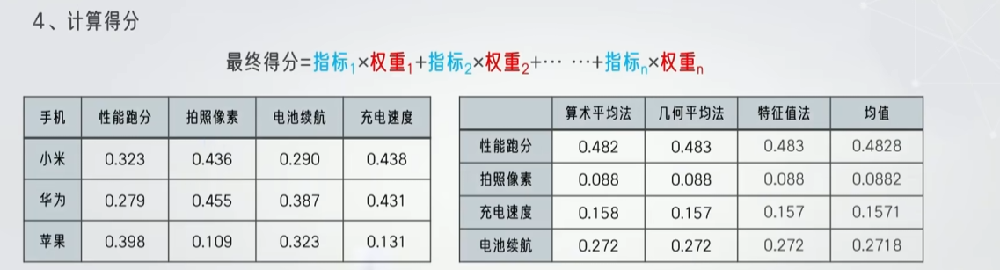

最终得分是算每一行的

## **总结步骤**

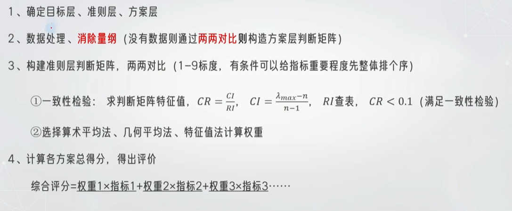

# **<mark> TOPSIS </mark>**

topisis是一种得出评价对象与理想化目标的相对接近程度并排序，从而进行结果评价的方法

## 常见TOPSIS流程

原始评价矩阵→正向化→归一化（标准化）→加权→计算理想解距离→计算贴近度

标准化是按照方差缩放，归一化是直接按范围缩放

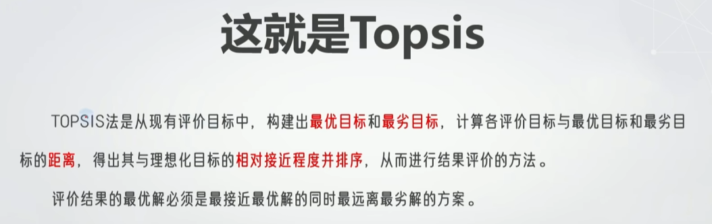

## **求解步骤：**

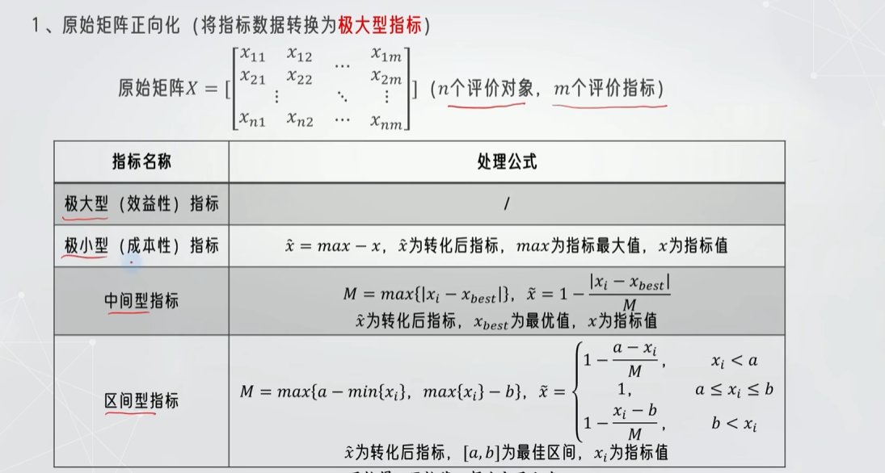

例子：原始表格

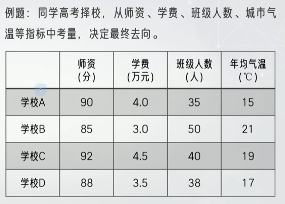

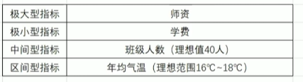

一般情况下理想值和理想范围会由题目给出

正向化后的表格：

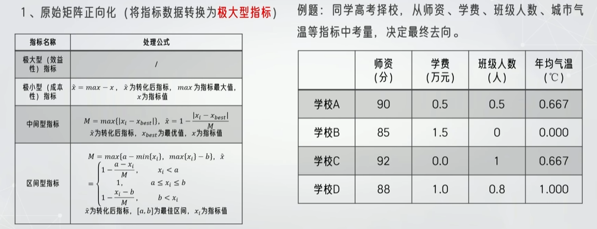

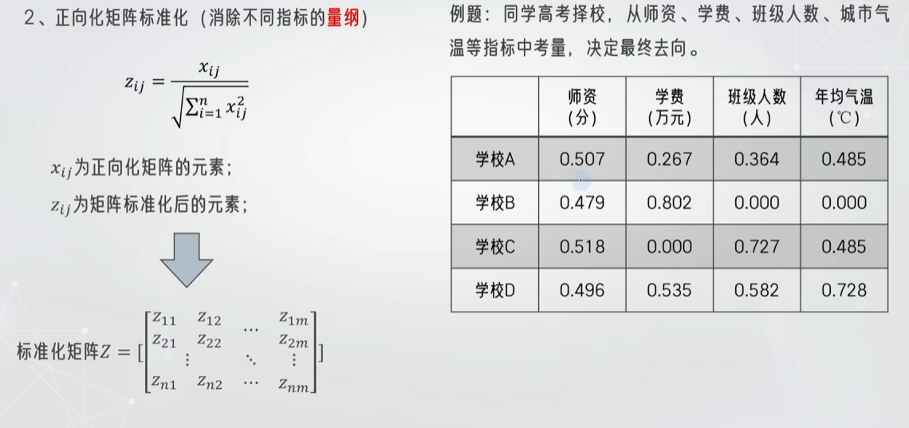

这步使每个数据的范围都被调整为0到1

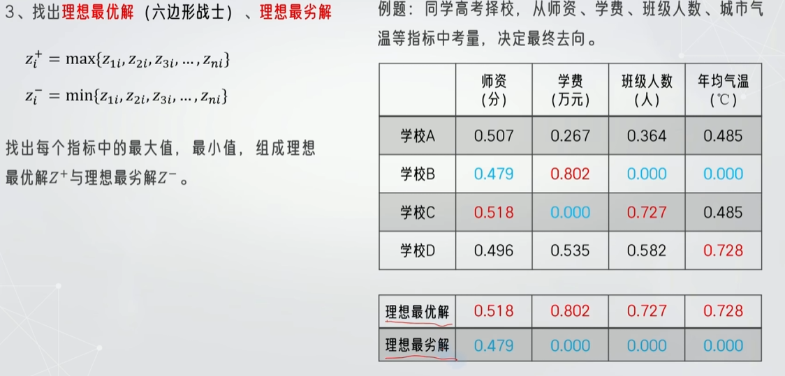

理想最优解就是每列指标中的最大值

理想最劣解就是每列指标中的最小值

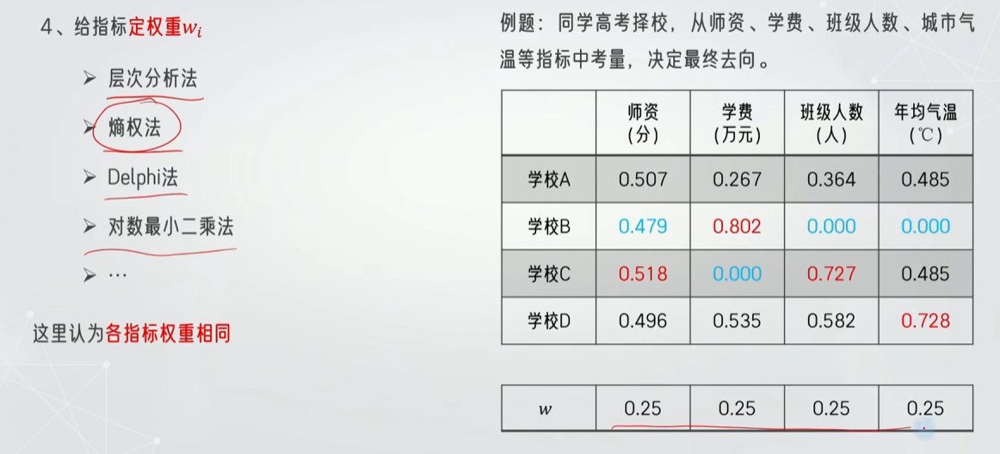

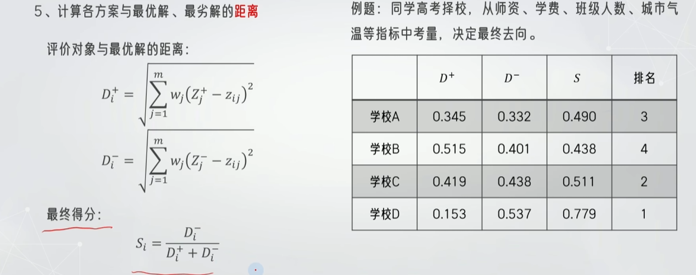

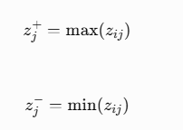

zj+就是理想最优解，zj-就是理想最劣解

zij就是标准化后矩阵的每个元素

Di+和Di-都是每一行算的

w就是权重，可以通过各种方法计算出来，本题直接将权重均分了

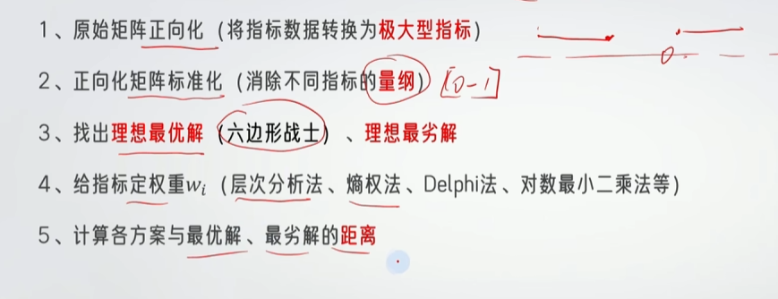

# **<mark>熵权法</mark>**

信息熵对数据正向化、标准化和归一化之后，就得到了每件事情发生的一个概率

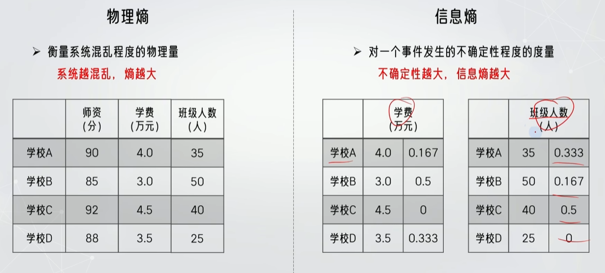

## **求解步骤：**

1. 矩阵正向化

2. 矩阵标准化

3. 矩阵归一化

4. 求信息熵、信息效用值、熵权

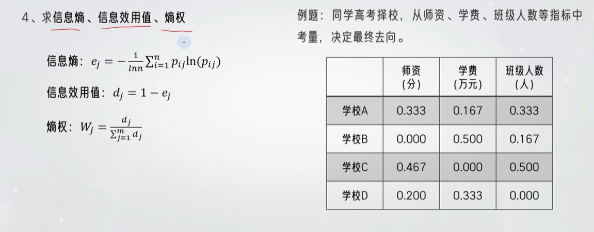

算的时候都是按列去算的

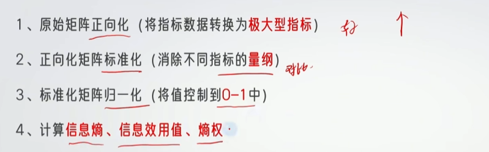

```
import numpy as np

#定义一个自定义的对数函数mylog，用于处理输入数组中的零元素
def mylog(p):
    n=len(p) #获取输入向量p的长度
    lnp=np.zeros(n) #创建一个长度为n，元素都为0的新数组lnp
    for i in range(n): #对向量p的每一个元素进行循环
        if p[i]==0:  #如果当前元素的值为0
            lnp[i]=0 #则在lnp中对应位置也设置为0.因为log（0）是未定义的，这里我们规定为0
        else:
            lnp[i]=np.log(p[i])  #如果p[i]不为0，则计算其自然对数并赋值给lnp的对应位置
        return lnp  #返回计算后的对数数组

#定义一个指标矩阵x（已正向化后的）
x=np.array([[5/7,1/3,2/3],[0,1,1/3],[1,0,1],[3/7,2/3,0]])

#将x矩阵标准化
z=x/np.sqrt(np.sum(x**2,axis=0))

print(f"标准化矩阵z={z}")

#计算熵权所需的变量和矩阵初始化
n,m=z.shape   #获取标准化矩阵z的行数和列数
D=np.zeros(m)  #初始化一个长度为m的数组D，用于保存每个指标的信息效用值


#计算每个指标的信息效用值
for i in range(m):  #遍历z的每一列
    x=z[:,i]  #获取z的第i列，即第i个指标的所有数据
    p=x/np.sum(x)  #对第i个指标的数据进行归一化处理，得到概率分布p
    print(p)
    #使用自定义的mylog函数计算p的对数，不用np.log的原因是因为p中有0的值
    e=-np.sum(p*mylog(p))/np.log(n)  #根据熵的定义计算第i个指标的信息熵e
    D[i]=1-e  #根据信息熵计算信息效用值

w=D/np.sum(D) #计算熵权
print(f"w={w}")
```

# **<mark>模糊综合评价</mark>**

基本步骤：

### ① 确定评价等级

### ② 确定隶属函数

例如：

GDP：

建立分段函数

### ③ 得到隶属矩阵

例如：

每一行代表一个指标。

### ④ 求权重

例如：

$$
A=
\begin{bmatrix}
0.8 & 0.2 & 0 &0\\
0.6 & 0.3 & 0.1 &0\\
0.2 &0.5 &0.3 &0
\end{bmatrix}
$$

熵权法：W=(0.3,0.4,0.2,0.1)

### ⑤ 综合评价

B=W⋅R

得到最终评价。

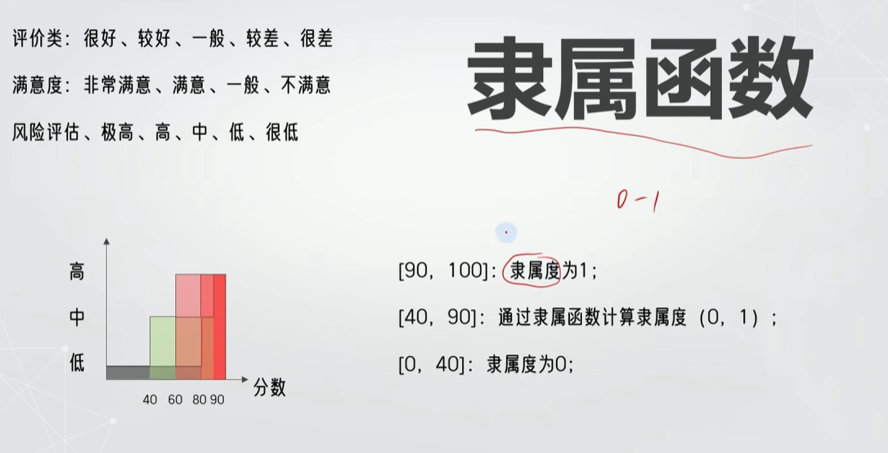

[90,100]这个区间是大家公认的考得很好的区间

[0,40]这个区间是大家公认的考得很差的区间

## **确定隶属函数**

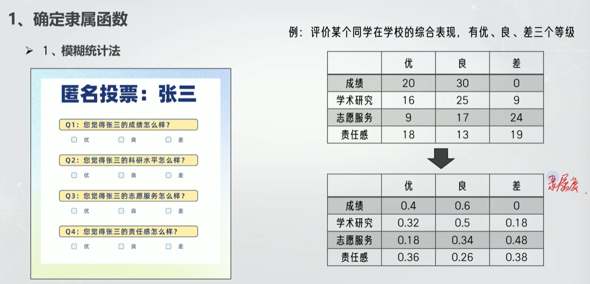

模糊统计或专家打分都可以

这种方法主观意识强烈（隶属度是按行算的）

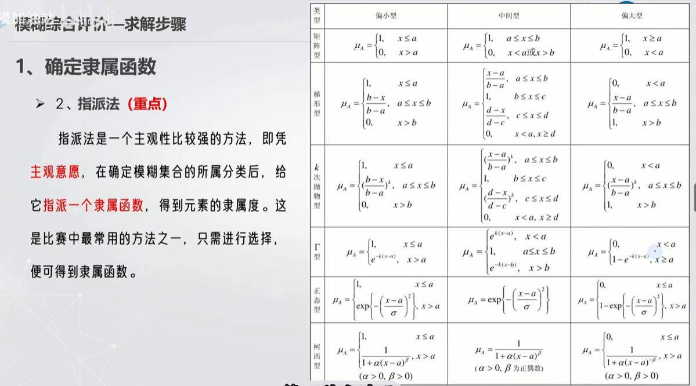

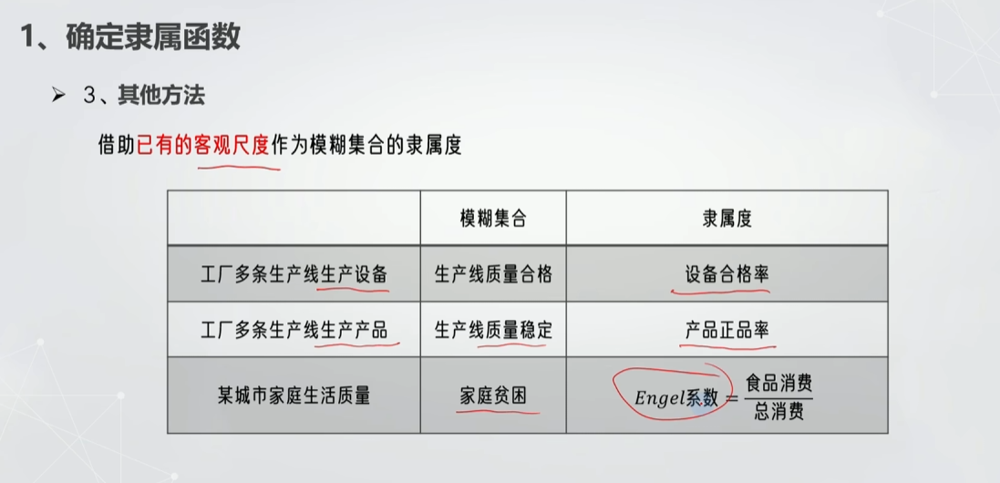

# **<mark>灰色关联分析</mark>**

## **灰色关联分析核心是计算变量之间的关联度**

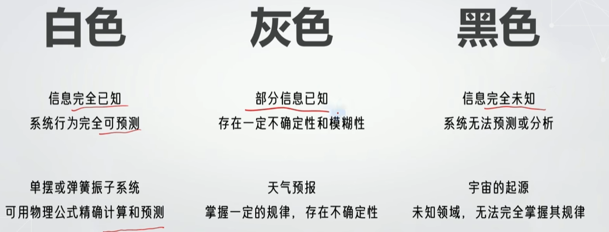

## **灰色关联分析中的量纲统一（无量纲化）**

在灰色关联分析中，不同指标往往具有不同的单位和数量级，例如：

- GDP（亿元）
- 人口（万人）
- 污染排放量（吨）

这些指标不能直接比较，需要进行**无量纲化处理**。

1. 初值化处理初值化处理

将每个序列中的数据除以该序列第一个数据：

$$
x_i'(k)=\frac{x_i(k)}{x_i(1)}
$$

$$
X=[10,12,15,20]\\       
X'=
\left[
\frac{10}{10},
\frac{12}{10},
\frac{15}{10},
\frac{20}{10}
\right]
=
[1,1.2,1.5,2]
$$

2. 均值化处理（最常用）

每个数据除以该序列的平均值：

$$
x_i'(k)=
\frac{x_i(k)}
{\frac{1}{n}\sum_{k=1}^{n}x_i(k)}
$$

$$
X=[10,20,30]\\
X'=[0.5,1,1.5]
$$

3. 极值化处理
- 正向指标：指标越大越好：

例如：

- GDP
- 收入
- 产量

$$
x_i'(k)=
\frac{x_i(k)}
{\max x_i(k)}
$$

$$
X=[20,40,60]\\
X'=
[\frac{20}{60},\frac{40}{60},\frac{60}{60}]
=
[0.33,0.67,1]
$$

- 负向指标：指标越小越好

例如：

- 成本
- 污染
- 风险

$$
x_i'(k)=
\frac{\max x_i(k)-x_i(k)}
{\max x_i(k)-\min x_i(k)}
$$

$$
X=[20,40,60]\\
X'=[1,0.5,0]
$$

## **灰色关联分析基本步骤**

1. 建立原始矩阵

2. 无量纲化

3. 计算差异信息

$$
\Delta_i(k)=|X_0(k)-X_i(k)|
$$

4. 计算灰色关联系数

$$
\xi_i(k)=
\frac{\Delta_{\min}+\rho\Delta_{\max}}
{\Delta_i(k)+\rho\Delta_{\max}}
$$

p为分辨系数，一般取0.5~~~~

5. 计算灰色关联度

$$
r_i=
\frac1n
\sum_{k=1}^{n}\xi_i(k)
$$

关联度越大，说明该方案与参考序列越接近。

# **<mark>AI在数学建模中的应用</mark>**

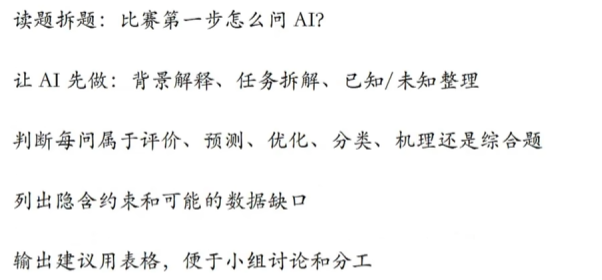

# **<mark>评价决策类赛题分析</mark>**

评价类问题的标准流程为：

确定评价对象---->构建评价指标体系---->指标正向化处理---->数据标准化---->计算指标权重---->得到综合得分---->排序与结果解释---->灵敏度分析

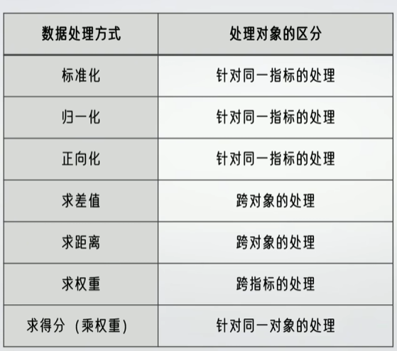

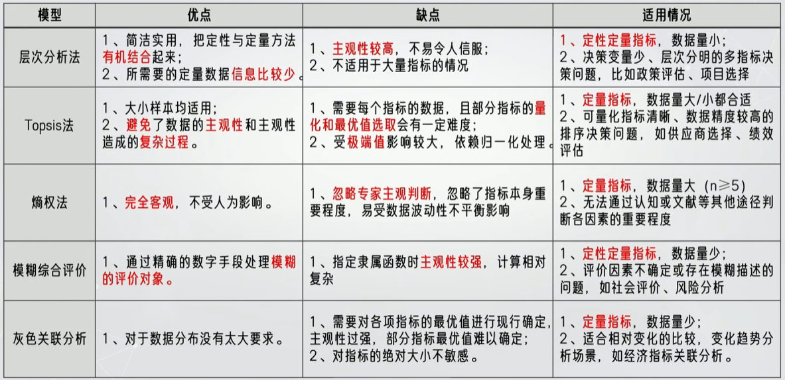

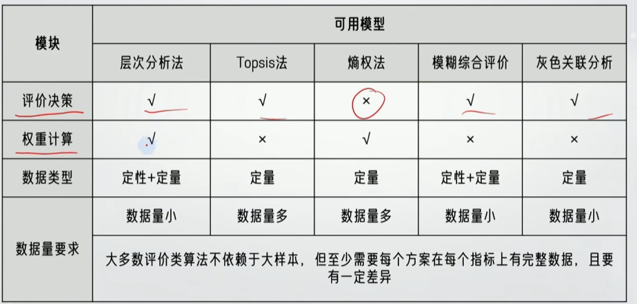

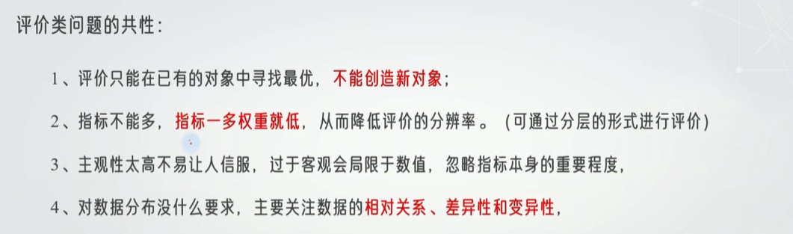

# **<mark>一元线性回归分析</mark>**

线性关系是指变量之间的关系是一次函数

回归概念：预测一个连续问题的数值

## **具体公式**

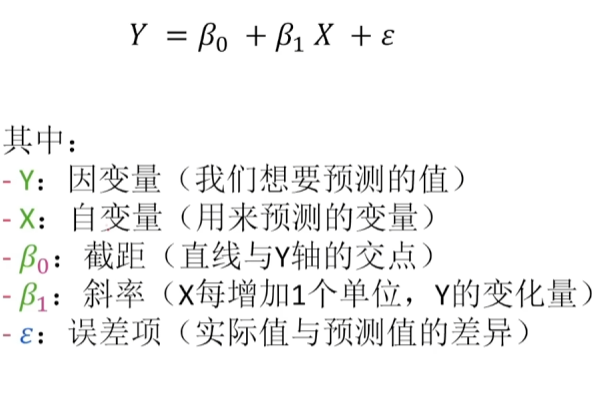

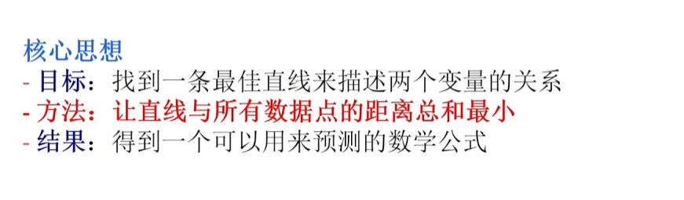

线性回归评价指标决定系数

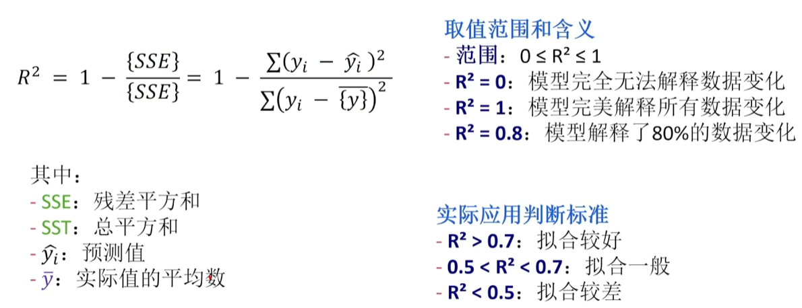  

线性回归模型，永远都使用Linearregression

简单示例：

```
from sklearn.linear_model import LinearRegression

model = LinearRegression()

model.fit(X_train, y_train)  #训练模型

y_pred = model.predict(X_test)  #模型预测
```

# **<mark>多元线性回归分析</mark>**
